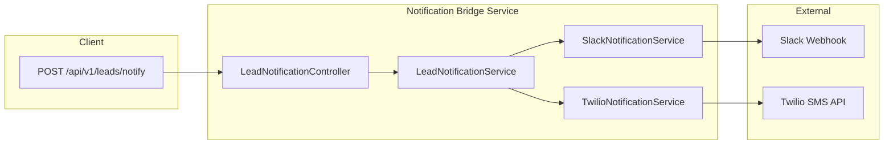

# Notification Bridge Service – Implementation Plan

## Stack and layout

- **Java 17+**, **Spring Boot 3.x** (Jakarta namespace).
- **Build**: Maven.
- **Base package**: `com.notificationbridge` (or your choice; adjust all paths below accordingly).

---

## 1. Project bootstrap

- **pom.xml**: Spring Boot 3.x parent; dependencies:
  - `spring-boot-starter-web`, `spring-boot-starter-validation`
  - `spring-boot-starter-security`
  - `springdoc-openapi-starter-webmvc-ui` (OpenAPI 3 / Swagger for Spring Boot 3)
  - `spring-retry` + `spring-boot-starter-aop` (or Resilience4j for retries)
  - Twilio SDK (`com.twilio.sdk:twilio`) for production Twilio calls
  - Lombok (optional) for DTOs/models
- **application.yml** (and **application-dev.yml**, **application-prod.yml**): server port, logging; placeholders for Slack webhook URL, Twilio credentials, API key, JWT issuer/audience.
- **Main class**: `NotificationBridgeServiceApplication.java` in `com.notificationbridge`.

---

## 2. Model and DTOs

- **model/LeadEvent.java**  
Request body mapping: `leadId`, `name`, `company`, `email`, `phone`, `priority` (enum: e.g. `HIGH`, `MEDIUM`, `LOW`), `createdAt` (e.g. `Instant` or `OffsetDateTime`). Use `@NotNull`/`@NotBlank` and `@JsonProperty` as needed so the example JSON matches.
- **dto/NotificationResponse.java**  
Response body: `status` (enum, e.g. `NOTIFICATIONS_SENT`, `PARTIAL_FAILURE`, `SKIPPED`), `slack` (e.g. `SUCCESS`/`FAILED`), `sms` (e.g. `SUCCESS`/`FAILED`). Add getters/setters or Lombok.
- **dto/ChannelResult.java** (optional)  
Reusable “channel + outcome” if you want to generalize beyond `slack`/`sms` later.

---

## 3. Controller

- **controller/LeadNotificationController.java**
  - `POST /api/v1/leads/notify`
  - Consumes `application/json`; body: `@Valid LeadEvent`.
  - Returns `ResponseEntity<NotificationResponse>` (or `NotificationResponse` with `@ResponseStatus`).
  - Delegates to `LeadNotificationService.notify(LeadEvent)`; no business logic in controller.
  - Secured with `@PreAuthorize` or security config so only authenticated requests reach it.

---

## 4. Services

- **service/NotificationService.java** (interface)
  - `NotificationResult send(LeadEvent lead)` (or similar).
  - Abstraction for “one channel” (Slack or SMS). Implementations return success/failure so the orchestrator can build `NotificationResponse`.
- **service/SlackNotificationService.java**
  - Implements `NotificationService` (or a dedicated interface for Slack).
  - Builds Slack webhook payload (e.g. blocks or simple text) with **all** lead fields (leadId, name, company, email, phone, priority, createdAt).
  - In **prod**: `RestTemplate` or `WebClient` POST to configured webhook URL.
  - In **dev**: mock implementation that logs and returns success (see “Config & profiles” below).
- **service/TwilioNotificationService.java**
  - Implements `NotificationService` (or dedicated interface for SMS).
  - Builds **concise** SMS text (e.g. “New HIGH lead: Name, Company, Phone”).
  - In **prod**: use Twilio SDK to send SMS to configured number (or to `lead.getPhone()` if required).
  - In **dev**: mock that logs and returns success.
- **service/LeadNotificationService.java**
  - Orchestrator:
    - If `lead.getPriority() != HIGH` → return response with `status = SKIPPED`, slack/sms not sent (or N/A).
    - If HIGH: call `SlackNotificationService.send(lead)` and `TwilioNotificationService.send(lead)`.
    - Apply **retries** around each external call (see Retries below).
    - Build `NotificationResponse`: set `status` to `NOTIFICATIONS_SENT` or `PARTIAL_FAILURE` based on channel results; set `slack`/`sms` to `SUCCESS` or `FAILED`.
    - On any exception from a channel: catch, **log** (with lead id and channel), record that channel as failed, continue with the other channel when applicable.

---

## 5. Retries and error handling

- **Retries**: Use `@Retryable` (Spring Retry) or Resilience4j `@Retry` on Slack and Twilio service methods (or on a thin wrapper used by `LeadNotificationService`). Configure max attempts (e.g. 3) and backoff; mark as `recover = false` or use a `@Recover` method that logs and returns a failure result so the orchestrator can set `slack`/`sms` to `FAILED`.
- **Logging**: Log every external call failure (and retries) with lead id, channel, and exception message so support can trace partial failures.

---

## 6. Security (API key and JWT)

- **config/SecurityConfig.java**
  - Permit only `/api/v1/leads/notify` (and actuator/health if needed) as authenticated; permit Swagger/OpenAPI paths (e.g. `/v3/api-docs`, `/swagger-ui/**`) without auth for docs.
  - **API key**: Custom filter that reads a header (e.g. `X-API-Key` or `Authorization: ApiKey <key>`) and validates against a configured secret (e.g. from `application.yml`). If valid, set `Authentication` (e.g. `UsernamePasswordAuthenticationToken` with a principal and no credentials).
  - **JWT**: Optionally add `JwtAuthenticationFilter` (validate signature and expiry using application properties for issuer/audience); if a valid JWT is present, use it instead of API key. Order: e.g. “try JWT first, then API key” so both are supported.
  - Reject request with 401 if neither API key nor JWT is valid.
- **exception/UnauthorizedException.java**  
Custom exception thrown by the API-key/JWT logic when authentication fails.
- **exception/NotificationFailedException.java**  
Optional; use when you want to distinguish “notification channel failed” from “request invalid” (e.g. for partial failure reporting or logging). Can be thrown from `@Recover` or from services and mapped in the global handler.

---

## 7. Exceptions and global handler

- **exception/GlobalExceptionHandler.java**  
`@RestControllerAdvice`:
  - `UnauthorizedException` → `401` with a clear body.
  - `NotificationFailedException` (if used) → e.g. `503` or `207` depending on your contract; or handle inside controller/service and only use handler for unexpected errors.
  - `MethodArgumentNotValidException` (validation) → `400` with field errors.
  - Generic `Exception` → `500` and log; return a safe message in body.

---

## 8. Config and profiles

- **config/AppConfig.java**
  - `@Configuration` and `@ConfigurationProperties` (or `@Value`) for Slack webhook URL, Twilio account SID, auth token, from-number; API key secret; JWT issuer/audience.
  - Define **two sets of beans** for Slack and Twilio:
    - **Dev** (`@Profile("dev")`): mock implementations that log and return success (or inject mock beans into `SlackNotificationService`/`TwilioNotificationService` so the same class uses a mock client in dev).
  - **Prod**: real `RestTemplate`/`WebClient` and Twilio client beans.  
  So: either “mock service impl” vs “real service impl” per profile, or “mock HTTP client” vs “real HTTP/Twilio client” injected into the same service class.
- **config/SwaggerConfig.java**
  - Use springdoc-openapi: `@Configuration` and a `GroupedOpenApi` or `OpenAPI` bean to describe the API title “Notification Bridge Service”, version, and the single endpoint `POST /api/v1/leads/notify` (summary, request body schema from `LeadEvent`, response schema from `NotificationResponse`). Optionally add security scheme (API key in header and/or Bearer JWT) so Swagger UI can send the key/token.

---

## 9. Docker and docker-compose

- **Dockerfile**  
Multi-stage: build with Maven (e.g. `mvn -B package -DskipTests`), run with `eclipse-temurin:17-jre-alpine`; `ENTRYPOINT ["java","-jar","/app.jar"]`; expose port (e.g. 8080). Copy only the built JAR into the runtime image.
- **docker-compose.yml**
  - Single service (e.g. `notification-bridge`) building from Dockerfile or using an image; map port 8080:8080; environment variables for Slack webhook, Twilio credentials, API key (and JWT settings if used). Use env_file or explicit `environment:` so the app can run without local `application.yml` secrets.

---

## 10. File and package summary

| Package    | File                                        | Purpose                                  |
| ---------- | ------------------------------------------- | ---------------------------------------- |
| (root)     | `NotificationBridgeServiceApplication.java` | Main class                               |
| (root)     | `pom.xml`, `application.yml`                | Build and config                         |
| controller | `LeadNotificationController.java`           | POST /api/v1/leads/notify                |
| service    | `LeadNotificationService.java`              | Orchestrate, filter HIGH, build response |
| service    | `SlackNotificationService.java`             | Slack webhook (real + dev mock)          |
| service    | `TwilioNotificationService.java`            | Twilio SMS (real + dev mock)             |
| service    | `NotificationService.java`                  | Optional interface for channels          |
| model      | `LeadEvent.java`                            | Request body                             |
| dto        | `NotificationResponse.java`                 | Response body                            |
| config     | `SecurityConfig.java`                       | API key + JWT                            |
| config     | `SwaggerConfig.java`                        | OpenAPI doc                              |
| config     | `AppConfig.java`                            | Properties, mock/real beans per profile  |
| exception  | `UnauthorizedException.java`                | 401 cases                                |
| exception  | `NotificationFailedException.java`          | Channel failure                          |
| exception  | `GlobalExceptionHandler.java`               | Map exceptions to HTTP responses         |

---

## 11. Behavior checklist

- Only **HIGH** priority leads trigger Slack and SMS; others return `status: SKIPPED`.
- Slack message: **all** lead info (leadId, name, company, email, phone, priority, createdAt).
- Twilio SMS: **concise** (e.g. one short line: lead name, company, phone).
- **Retries** on failed Slack/Twilio calls; **log** errors and record channel as `FAILED` in response.
- Response: **structured** `NotificationResponse` with `status`, `slack`, `sms`.
- **Secure** endpoint with API key or JWT; Swagger documents the security.
- **Mock** Slack/Twilio in dev profile; real in prod.
- **Dockerfile** and **docker-compose** ready for local and CI deployment.

---

## 12. Optional enhancements (out of scope unless you ask)

- Actuator health (e.g. `/actuator/health`) and readiness.
- Rate limiting per API key.
- Persistence of lead events or notification audit log.

This plan gives you a single endpoint, clear package layout, security (API key + JWT), retries, structured responses, OpenAPI, and Docker, with dev mocks for Slack and Twilio.